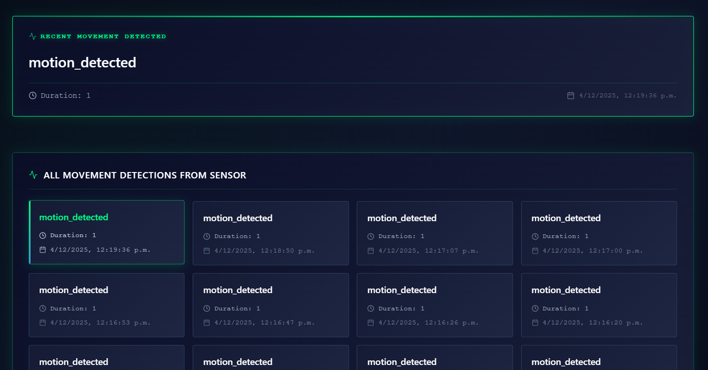
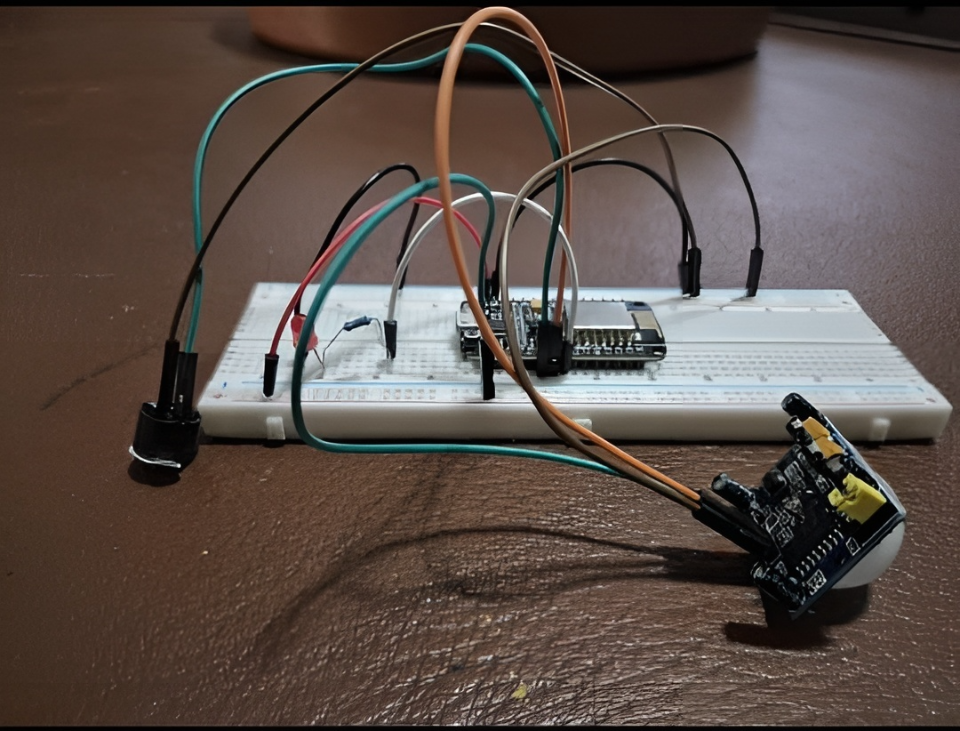

# 🚨 IoT Night Alarm System

A comprehensive IoT motion detection system built with ESP8266, Node.js, MongoDB, and React. This project monitors movement using a PIR sensor, triggers local alerts (LED + buzzer), and sends real-time data to a web dashboard.


## 📋 Table of Contents

- [Features](#features)
- [Architecture](#architecture)
- [Hardware Requirements](#hardware-requirements)
- [Software Stack](#software-stack)
- [Project Structure](#project-structure)
- [Installation](#installation)
- [Configuration](#configuration)
- [Usage](#usage)
- [API Documentation](#api-documentation)
- [Screenshots](#screenshots)
- [Troubleshooting](#troubleshooting)
- [Contributing](#contributing)
- [License](#license)

## ✨ Features

- **Real-time Motion Detection**: PIR sensor (HC-SR501) detects movement instantly
- **Local Alerts**: LED and active buzzer provide immediate visual/audio feedback
- **IoT Connectivity**: ESP8266 sends HTTP POST requests to backend API
- **Cloud Storage**: Movement events stored in MongoDB Atlas
- **Live Dashboard**: React-based web interface with auto-refresh (5-second polling)
- **Motion Duration Tracking**: Calculates and logs how long movement lasted
- **TypeScript**: Fully typed backend and frontend for better code quality
- **Layered Architecture**: Clean separation of concerns (Routes → Controllers → Services → Models)

## 🏗️ Architecture

```
┌─────────────┐
│   ESP8266   │ ──WiFi──┐
│  + PIR      │         │
│  + LED      │         │
│  + Buzzer   │         │
└─────────────┘         │
                        ▼
                 ┌──────────────┐
                 │   Backend    │
                 │  (Node.js)   │
                 │   Express    │
                 └──────┬───────┘
                        │
                        ▼
                 ┌──────────────┐
                 │   MongoDB    │
                 │    Atlas     │
                 └──────┬───────┘
                        │
                        ▼
                 ┌──────────────┐
                 │   Frontend   │
                 │    React     │
                 │   + Vite     │
                 └──────────────┘
```

## 🔧 Hardware Requirements

### Components

- **ESP8266 NodeMCU** (1x)
- **PIR Motion Sensor HC-SR501** (1x)
- **Red LED 5mm** (1x)
- **Active Buzzer** (1x)
- **Resistor 330Ω** (1x)
- **Breadboard** (1x)
- **Jumper Wires** (Male-to-Male)
- **Micro USB Cable** (1x)
- **5V Power Supply** (USB adapter or PC)

### Wiring Diagram

| Component | ESP8266 Pin | Notes |
|-----------|-------------|-------|
| PIR VCC | VIN | 5V power |
| PIR GND | GND | Ground |
| PIR OUT | D6 (GPIO12) | Signal |
| LED Anode | D5 (GPIO14) | Via 330Ω resistor |
| LED Cathode | GND | Ground |
| Buzzer + | D7 (GPIO13) | Positive terminal |
| Buzzer - | GND | Ground |

## 💻 Software Stack

### Backend
- **Runtime**: Node.js 20+
- **Framework**: Express.js 5.x
- **Language**: TypeScript 5.x
- **Database**: MongoDB Atlas
- **ODM**: Mongoose 8.x
- **Middleware**: CORS, dotenv

### Frontend
- **Framework**: React 19.x
- **Build Tool**: Vite 6.x
- **Language**: TypeScript 5.8
- **HTTP Client**: Axios 1.x
- **Date Formatting**: date-fns 4.x

### IoT Device
- **Platform**: ESP8266 (Arduino Framework)
- **Libraries**: ESP8266WiFi, ESP8266HTTPClient, WiFiClient

## 📁 Project Structure

```
alarm-system/
├── backend/
│   ├── src/
│   │   ├── config/
│   │   │   └── db.ts
│   │   ├── controllers/
│   │   │   └── movementController.ts
│   │   ├── models/
│   │   │   └── Movement.ts
│   │   ├── routes/
│   │   │   └── movements.ts
│   │   ├── services/
│   │   │   └── movementService.ts
│   │   ├── types/
│   │   │   └── IMovement.ts
│   │   ├── app.ts
│   │   └── index.ts
│   ├── package.json
│   ├── tsconfig.json
│   └── .env
│
├── frontend/
│   ├── src/
│   │   ├── components/
│   │   │   ├── MovementsList.tsx
│   │   │   └── RecentMovement.tsx
│   │   ├── hooks/
│   │   │   └── useMovements.ts
│   │   ├── services/
│   │   │   └── movementsService.ts
│   │   ├── types/
│   │   │   └── Movement.ts
│   │   ├── App.tsx
│   │   └── main.tsx
│   ├── package.json
│   ├── tsconfig.json
│   ├── vite.config.ts
│   ├── .env
│   └── .env.example
│
├── esp8266/
│   └── motion_detector.ino
│
├── docs/
│   └── images/
│
└── README.md
```

## 🚀 Installation

### Prerequisites

- Node.js 20+ and npm
- MongoDB Atlas account (free tier)
- Arduino IDE with ESP8266 board support
- Git

### 1. Clone Repository

```bash
git clone https://github.com/yourusername/alarm-system.git
cd alarm-system
```

### 2. Backend Setup

```bash
cd backend
npm install
```

Create a `.env` file in the backend directory with your MongoDB connection string, server port, and frontend URL for CORS configuration.

Start development server:
```bash
npm run dev
```

### 3. Frontend Setup

```bash
cd frontend
npm install
```

Create a `.env` file in the frontend directory with the backend API URL. You can copy from `.env.example` and adjust as needed.

Start development server:
```bash
npm run dev
```

### 4. ESP8266 Setup

1. Open the Arduino sketch file in Arduino IDE
2. Install required libraries (ESP8266WiFi, ESP8266HTTPClient are built-in)
3. Update WiFi credentials and backend server IP address in the sketch
4. Select board: **NodeMCU 1.0 (ESP-12E Module)**
5. Upload sketch to ESP8266

## ⚙️ Configuration

### Backend Environment Variables

Create `backend/.env` file:

| Variable | Description | Example |
|----------|-------------|---------|
| `MONGODB_URI` | MongoDB connection string | Your Atlas connection string |
| `PORT` | Server port | 8080 |
| `FRONTEND_URL` | CORS allowed origin | http://localhost:5173 |

### Frontend Environment Variables

Create `frontend/.env` file:

| Variable | Description | Default |
|----------|-------------|---------|
| `VITE_API_BASE_URL` | Backend API URL | http://localhost:8080/api/movements |


### ESP8266 Configuration

Update in the Arduino sketch:
- WiFi SSID and password
- Backend server IP address (your PC's local IP on the network)
- Pin assignments if different from defaults

## 📖 Usage

### Starting the System

1. **Start Backend**: Navigate to backend folder and run development server
2. **Start Frontend**: Navigate to frontend folder and run development server
3. **Power ESP8266**: Connect via USB to PC or wall adapter, wait 30 seconds for sensor calibration
4. **Access Dashboard**: Open browser at http://localhost:5173

### Testing Motion Detection

1. Wave hand in front of PIR sensor
2. LED turns on, buzzer sounds
3. When motion stops:
   - LED and buzzer turn off
   - HTTP POST sent to backend
   - MongoDB stores event
   - Dashboard updates within 15 seconds

## 📡 API Documentation

### Base URL
```
http://localhost:8080/api/movements
```

### Endpoints

#### Create Movement Event
- **Method**: POST
- **Path**: /
- **Body**: JSON with event type, timestamp, and duration
- **Response**: 201 Created with created movement object

#### Get All Movements
- **Method**: GET
- **Path**: /
- **Response**: 200 OK with array of all movements (sorted by most recent)

#### Get Recent Movement
- **Method**: GET
- **Path**: /recent
- **Response**: 200 OK with single most recent movement, or 404 if none exist

## 📸 Screenshots

### Dashboard Overview


### Hardware Assembly


## 🐛 Troubleshooting

### ESP8266 Won't Connect to WiFi
- Verify SSID and password are correct
- Check WiFi is 2.4GHz (ESP8266 doesn't support 5GHz)
- Ensure WiFi network is not hidden

### Backend Connection Errors
- Verify MongoDB URI is correct in .env file
- Check IP address in ESP8266 sketch matches your PC's local IP
- Ensure backend is running on specified port
- Check firewall isn't blocking connections

### Frontend Not Updating
- Open browser console for error messages
- Verify backend URL in frontend .env file
- Check CORS settings in backend
- Confirm MongoDB has data

### PIR Sensor False Triggers
- Wait full 30 seconds for calibration
- Adjust sensitivity potentiometer on HC-SR501
- Keep sensor away from heat sources and direct sunlight

## 📄 License

This project is licensed under the MIT License - see the LICENSE file for details.

---